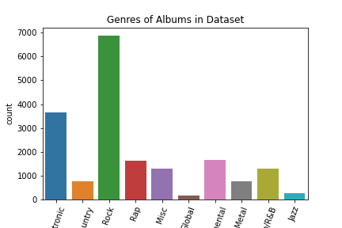

## Music-Recommender-Engine (SVD with Spotify Web API dataset) 
Music Rec Engine

The data set is a 14,000+ album Spotify Web API. It's features include the song name, published date, and song attributes such as speechiness, instrumentalness, loudness, mode, key, tempo, danceability, acousticness etc. This recommendation engine uses an SVD based on album ratings to recommend similar albums in a top 10 sorted list for listeners. Please see Final_NB.ipynb for coding. 

## EDA (brief)

Using the Surprise engine, I used a SVD algorithm to predict my ratings for albums according to artist. The RMSE is 2.3 (not good). But I will think of ways to implement Surprise to get a better RMSE. So far, we have no users for our data and so I just used artists instead (doesn't make too much sense though). The top 10 similar albums were returned based off their ratings from syndicates and predicted rating. This recommendation engine is bare bones but is a learning process that will get stronger with time. This is a first rec engine. 
